# Ivy — User flows

> Walks the nine-stage workflow end to end, threading the fifteen priority screens onto a single sample case. The single best document for understanding how the product behaves. ~12-minute read.

## The case threading every flow

**Mark Roberts** — 38, self-employed graphic designer, £62,000 income, £245,000 mortgage. Partner Sophie and two children. His brother was diagnosed with bowel cancer last month. Mark will be recommended onto Vitality decreasing-term life cover with accelerated critical-illness rider, at £42 per month.

**Three roles touch the product:**

- **Sarah** — adviser at Northchart Advisory, a UK protection-specialist firm with eight advisers. Primary user. Runs Mark's case from first contact through to compliance file closed.
- **Niamh** — back-office admin / paraplanner. Picks the case up after Sarah closes the suitability letter, takes it to the insurer and tracks underwriting.
- **Mark Reynolds** — firm principal. Watches the operations dashboard for firm-wide health.

Wireframe screenshots in this document resolve to [`../05-wireframes/screenshots/`](../05-wireframes/screenshots/). The live HTML files (with hover states and interactivity) are in [`../05-wireframes/`](../05-wireframes/) — open in any browser.

---

## Flow 1 · Lead arrives, gets qualified, gets booked

### Sarah's morning home

Sarah opens her browser at 8:45am. The home screen shows her what changed overnight: twelve new leads arrived (nine of them captured out-of-hours by Ivy's AI qualifier), two fact-find appointments are booked for today, one compliance flag is waiting for her, one vulnerable-customer indicator was raised on an overnight conversation with another lead.

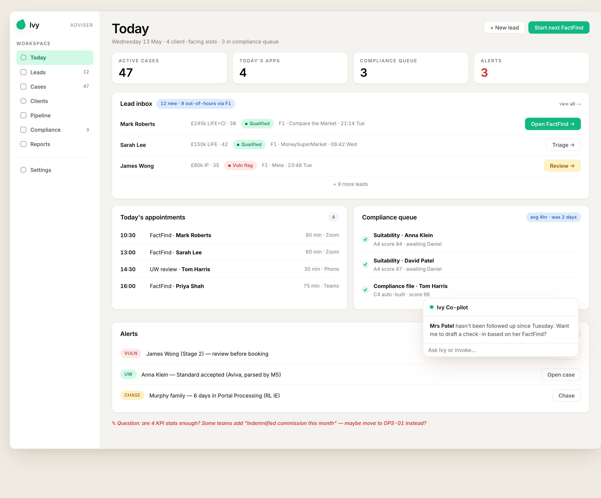

The home gives Sarah the four things she needs to start her day: a preview of the lead inbox, today's appointments, the compliance queue, and any live alerts. She clicks into the lead inbox.

### Lead inbox

Twelve new leads, sorted by qualification score. Each row shows the source (web form, comparison site, social ad, phone), the score, whether a vulnerability indicator has been flagged, and whether a fact-find has already been booked.

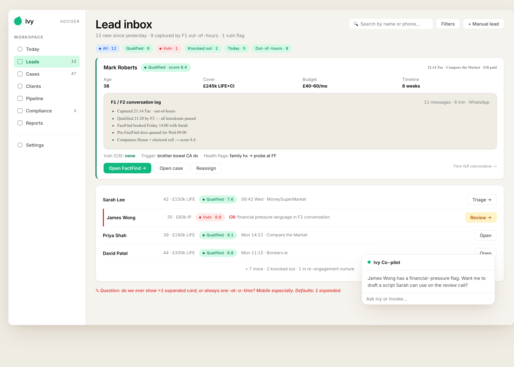

The leads were already qualified overnight. Mark Roberts came in at 11:42pm last Tuesday, had a seven-minute conversation with Ivy's AI qualifier, and confirmed a fact-find for Friday 11am — all before Sarah saw the lead. Sarah filters by booking status to see who needs prep today.

### Lead detail

Sarah clicks into Mark's row. She sees Mark's full lead profile: enriched from Companies House (self-employed, graphic design), the seven-minute AI qualifier transcript (28 turns), Mark's stated needs (£250k cover, term matching his mortgage, critical-illness rider), and the pre-fact-find disclosure pack that was automatically sent to Mark and e-signed yesterday.

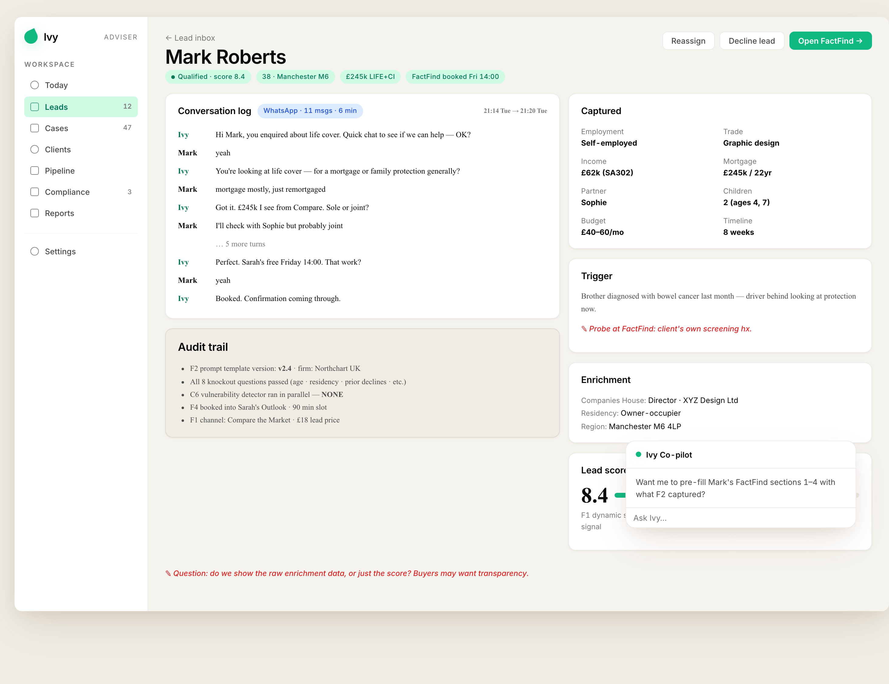

The pre-fact-find disclosure pack is the regulated paperwork the broker has to send before the call (Terms of Business, Privacy Notice, Initial Disclosure Document). Ivy sends this automatically the moment the fact-find is booked, using the firm's current version of each template.

Friday 11am, Sarah joins Mark's fact-find call.

---

## Flow 2 · The fact-find call

This is the centre of gravity of the product. Two screens matter here: the customer case canvas, and the live fact-find screen Sarah looks at during the call.

### Customer case canvas

Mark's case is now active in the system. The case detail screen is the **central canvas** — the master object every other surface in the product projects from. Sections fill in as the workflow progresses.

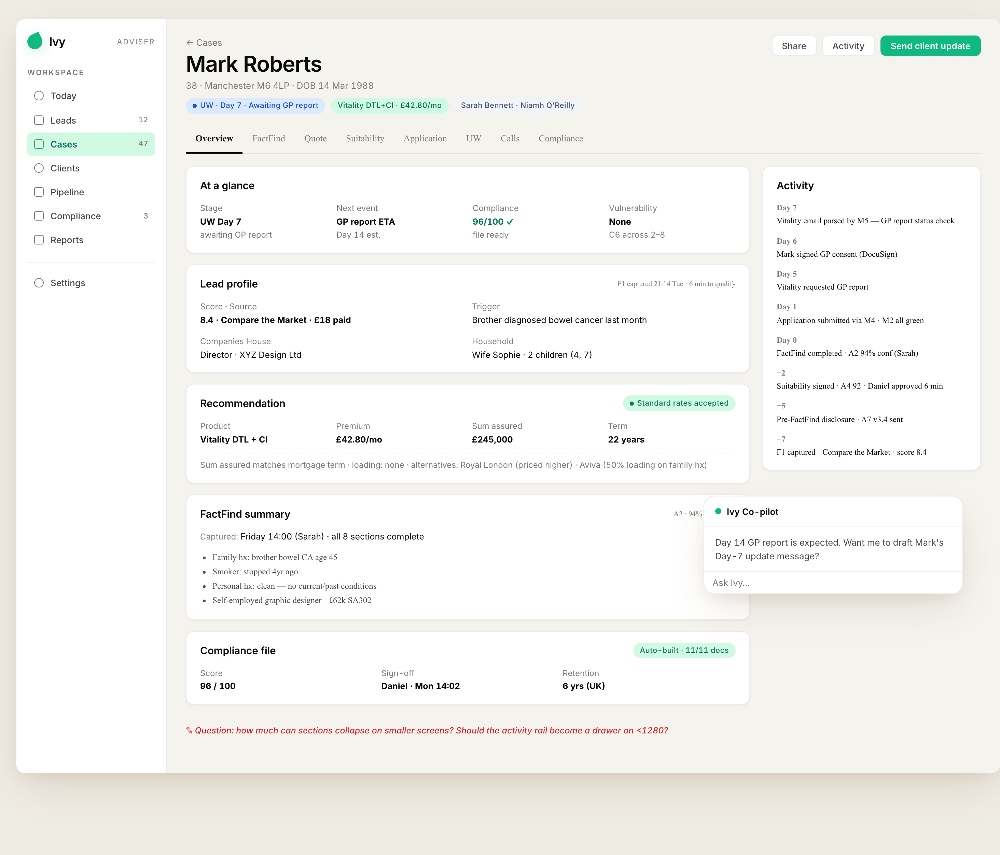

The sections in order: lead profile, the AI qualifier transcript, vulnerability flags, the booking, call recording and transcript (populates live during the fact-find), the structured fact-find data (populates live during the fact-find), quote inputs, quote results, suitability draft, application bundle and verification report, per-insurer submission status, insurer email log, client communications, compliance file index.

This is the single most important architectural principle in the product: **the case is the central data object**. Every other surface — the kanban card the admin sees, the row in the lead inbox, the documents in the compliance file viewer, the lines on the operations dashboard — is a *projection* of this single case. One data model. Many projections. No copy-paste. No drift. A detailed brief for this screen is in [`../03-information-architecture/per-screen-briefs/adv-05-case-detail.md`](../03-information-architecture/per-screen-briefs/adv-05-case-detail.md).

### Live fact-find — the most important screen in the product

Friday 11am. Sarah and Mark are on Zoom. The call recorder is running. The live fact-find screen is what Sarah looks at while she talks to Mark. **Critically, she is not typing into a form during the call** — the screen is doing that for her.

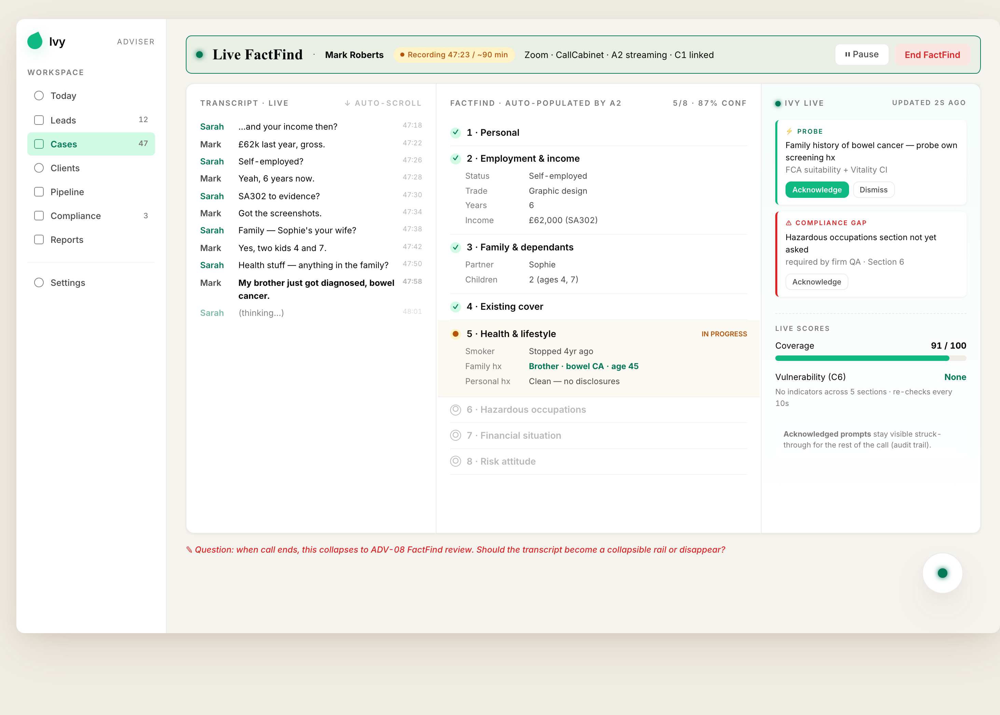

Three live columns:

**Left — the transcript.** Auto-scrolling. Every line is the speaker, the timestamp, and the verbatim. Sarah can click any line to surface the field in the fact-find structure that line fed into.

**Middle — the structured fact-find, auto-populating from the conversation.** Eight sections (Personal, Employment & income, Family & dependants, Existing cover, Health & lifestyle, Hazardous occupations, Financial situation, Risk attitude). Each section shows completion percentage and confidence percentage. As Mark speaks, the AI fills in fields. Sarah is the source of truth — every field is editable; the AI just proposes. Every field links back to the exact transcript timestamp that fed it.

**Right — Ivy Live, the in-call AI overlay.** Two things happen here in real time:

- **Probe suggestions.** Ivy notices Mark mentioned his brother's cancer diagnosis. It surfaces a suggestion to Sarah: *"Family history of bowel cancer — probe own screening history. FCA suitability + Vitality CI."* Sarah can acknowledge the prompt (it stays visible struck-through for the rest of the call, logged for audit) or dismiss it (also logged).
- **Vulnerability indicators.** Ivy watches the transcript for indicators of vulnerability — financial pressure, recent bereavement, capability concerns, health-related distress. If any indicator triggers, the panel shows it with the exact verbatim that triggered it.

Below the prompts and indicators: live coverage and vulnerability scores, and a note explaining the audit-trail principle (every prompt, response and acknowledgement is logged to the case file).

After the call ends, Sarah moves to a brief review state to confirm anything the AI got wrong, then signs off. The case advances to the research and quote stage. A detailed brief for this screen is in [`../03-information-architecture/per-screen-briefs/adv-07-live-factfind.md`](../03-information-architecture/per-screen-briefs/adv-07-live-factfind.md).

---

## Flow 3 · The suitability letter

The Monday after the call, the quote comes back from Vitality. Sarah selects Vitality decreasing-term life with accelerated critical-illness rider at £42 per month. The system has already drafted the seven-page suitability letter from Mark's fact-find combined with the chosen quote, written in Northchart's house template. Sarah is editing.

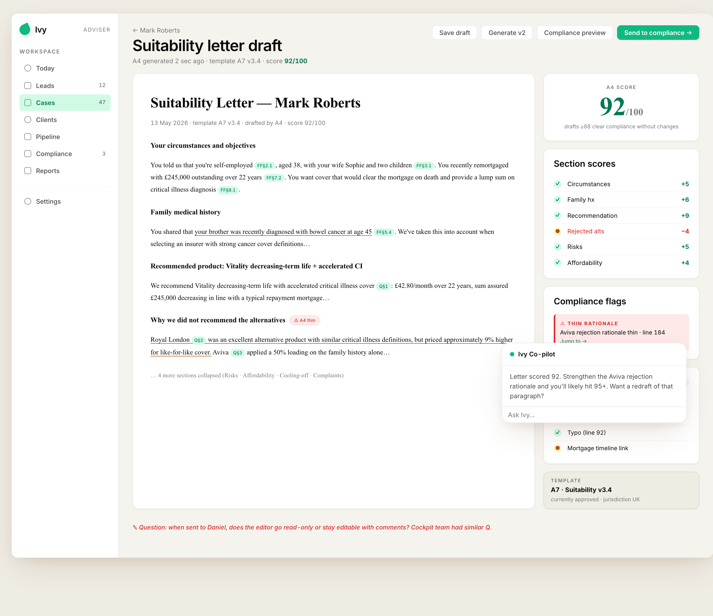

The screen has three columns:

**Left — the letter's outline, with traceability tags.** Every section has a tag pointing back to the fact-find field, the quote source, or the firm template version that justified the wording. A compliance officer reviewing the letter can click any tag to see exactly which fact-find answer or quote field produced a given recommendation.

**Middle — the letter itself, in a WYSIWYG editor.** AI-drafted paragraphs are tagged so Sarah can see what was generated versus what she edited. The "rejected alternatives" section (e.g. *"we considered Aviva but chose Vitality because…"*) is pre-justified by the AI with citations to the quote comparison.

**Right — the compliance score panel and edits queue.** A pre-submission compliance score gives Sarah a heads-up on issues the compliance officer is likely to flag. The edits queue surfaces sentences the AI flagged as low-confidence — Sarah reviews those first. A single button sends the letter to Daniel (the firm's compliance officer) for review.

A detailed brief is in [`../03-information-architecture/per-screen-briefs/adv-11-suitability-draft.md`](../03-information-architecture/per-screen-briefs/adv-11-suitability-draft.md).

After Daniel approves the letter, the case hands off to Niamh in the back office. Niamh works in a different surface — the admin kanban.

---

## Flow 4 · The back-office pipeline

Two-and-a-bit screens — the kanban Niamh works from, the drawer that opens over it, and the underwriting tracker that both Niamh and Sarah see.

### Admin kanban

Niamh's Monday-morning workspace. Mark's case is now in her queue (along with fourteen others). The board has four columns — **Inbox**, **Verifying**, **Submitting**, **Tracking** — and every case is a card.

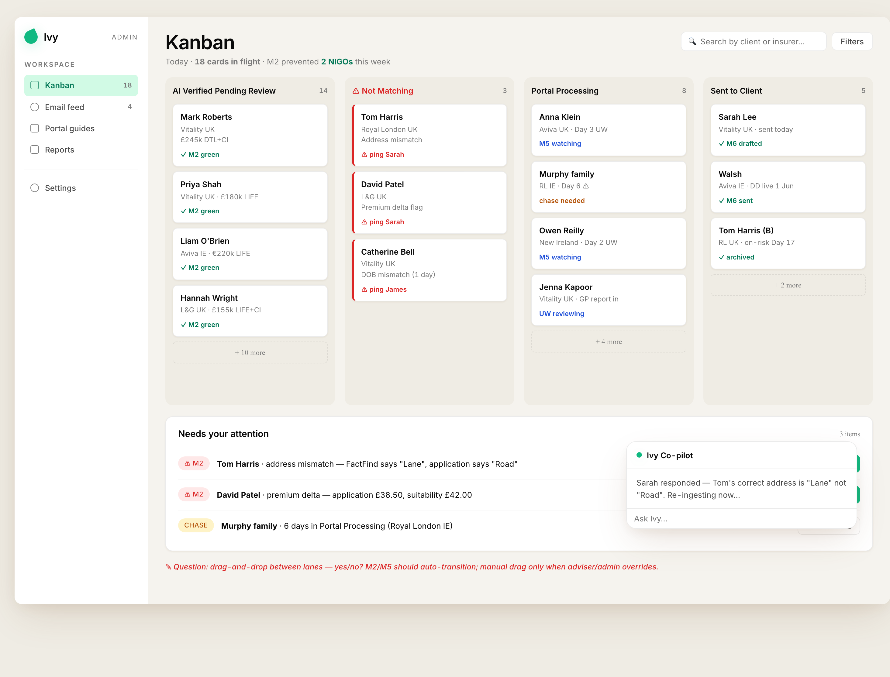

Each card shows the client name, the applicable insurers, the document-verification status (green / amber / red), the underwriting status, and the age of the oldest outstanding action. Niamh can drag cards to advance stages manually, but most cases auto-advance based on the underlying data. The board is filterable by adviser, by insurer, by case age, by vulnerability flag.

Niamh clicks Mark's card. A drawer opens over the kanban. Detail in [`../03-information-architecture/per-screen-briefs/adm-01-admin-kanban.md`](../03-information-architecture/per-screen-briefs/adm-01-admin-kanban.md).

### Admin drawer

The drawer is where Niamh actually works on a case.

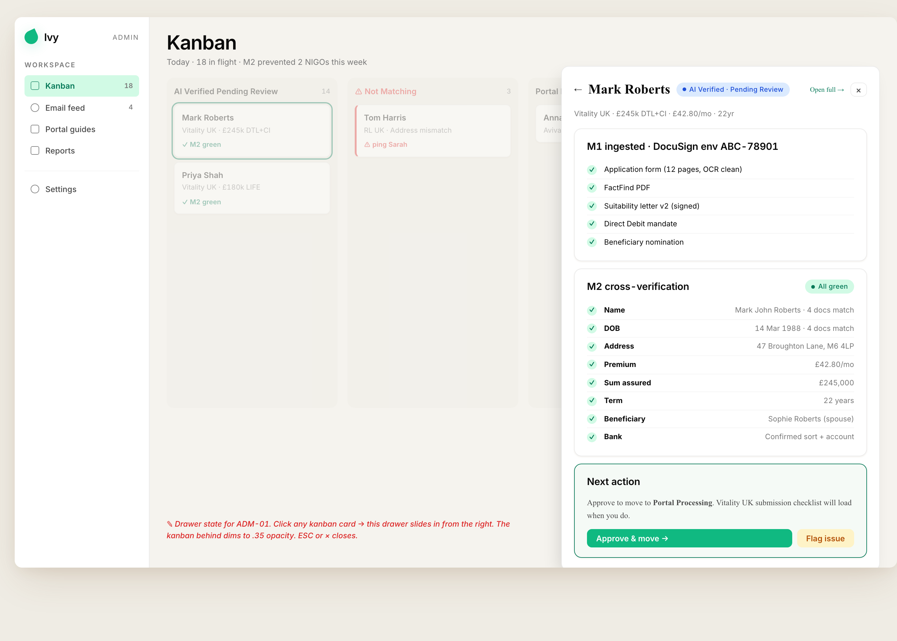

She sees: the documents that have been ingested for the case (application form, ID, key features illustration, fact-find, suitability letter). A cross-document verification report — the system has checked every data point matches across documents. If the fact-find says "non-smoker" but the Aviva application says "ex-smoker", the system flags the discrepancy with citations to both source documents. A per-insurer submission guide — for each insurer in the chosen panel, a step-by-step checklist. Ivy is the human-in-the-loop here: the broker, not Ivy, fills the insurer portal. Ivy guides. Drafted cover emails per insurer using the firm's templates.

Once Niamh confirms submission, the case moves to underwriting tracking.

### Underwriting tracking

Both Sarah and Niamh see underwriting tracking — Sarah for her own cases, Niamh for the whole pipeline.

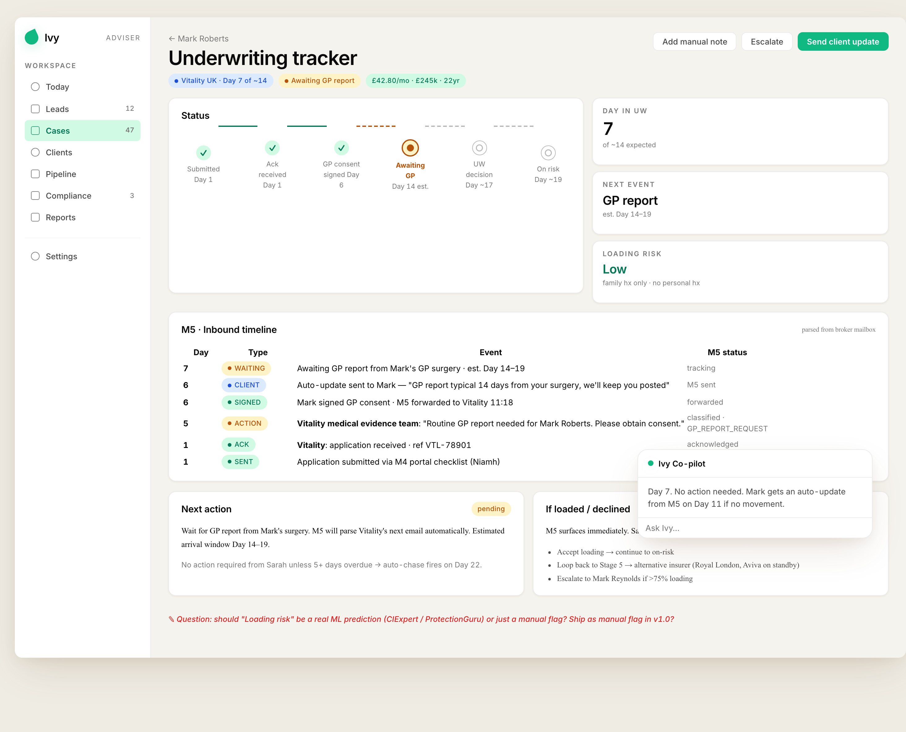

Each case has a timeline view: submission date, age of the case, GP-report request status, expected decision date, current insurer-side status. Status badges run through *Submitted → GP report requested → Underwriting review → (Loaded / Excluded / Declined) → Accepted*. Ageing alerts flag amber after the expected SLA, red after SLA-plus-five-days. A one-click chase action drafts a pre-written insurer chase email; sending it is logged for audit.

---

## Flow 5 · The compliance file

When Mark's policy goes on-risk, the compliance file is already audit-ready — because the system has been assembling it continuously through stages one to eight.

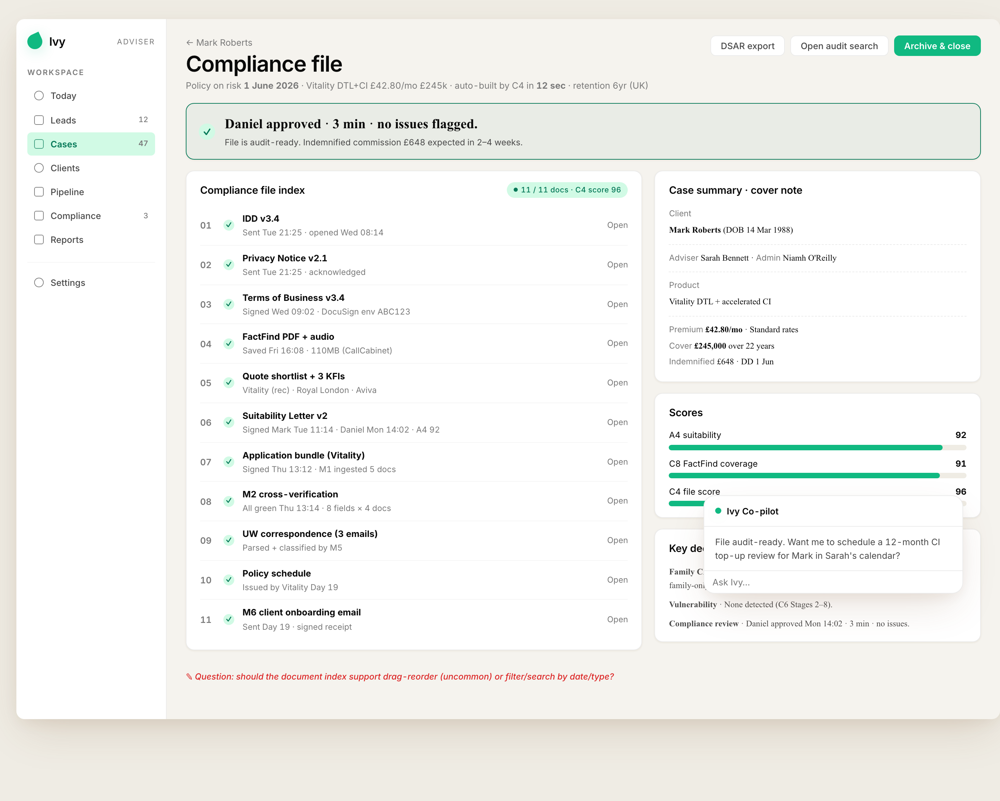

The eleven-document index covers: the Initial Disclosure Document, the Terms of Business, the fact-find, a Key Features Illustration per insurer, the suitability letter, the application form, the underwriting decision, the policy schedule, trust forms, the direct-debit mandate, and recordings (which link back to the call recording provider). Each row shows the document name, status (Present / Missing / Stale), timestamp, the template version used, and a preview button.

Two single-button exports: a Data Subject Access Request export for when a client asks for their data, and a regulator export that bundles the full file as a PDF plus call audio for inspection.

The audit-trail principle: every action taken across the case in stages one through eight is logged here. When a regulator asks *"did the adviser actually ask about hazardous occupations?"*, the compliance officer clicks the fact-find field, sees the transcript timestamp, and plays the exact thirty-second clip where Mark answered.

Critically for the build: the compliance file is a **projection** of the case, not a separately stored document set. Everything renders from the case data model.

---

## Flow 6 · The cross-surface AI co-pilot

The co-pilot is Ivy's AI assistant, accessible from anywhere in the product. Four modes.

**Welcome state.** The empty state when no conversation is open. Suggestion chips for common requests: *"draft a chase email to Aviva for case X"*, *"what's our latest income-protection commission run-rate?"*, *"show me cases ageing past expected underwriting SLA"*.

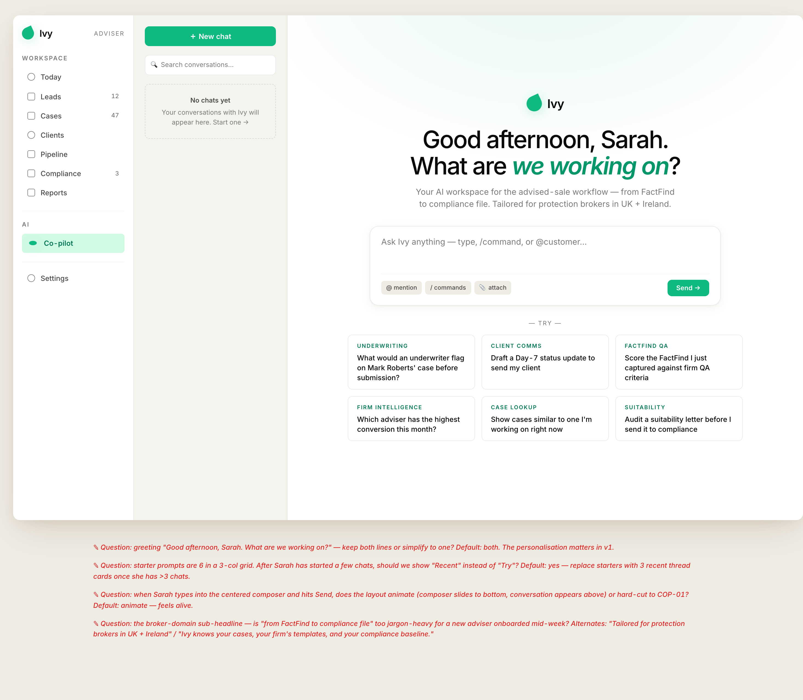

**Full-page workspace.** A dedicated workspace for longer queries — multi-case analysis, drafting emails or letters, asking the co-pilot to explain why a compliance score dropped.

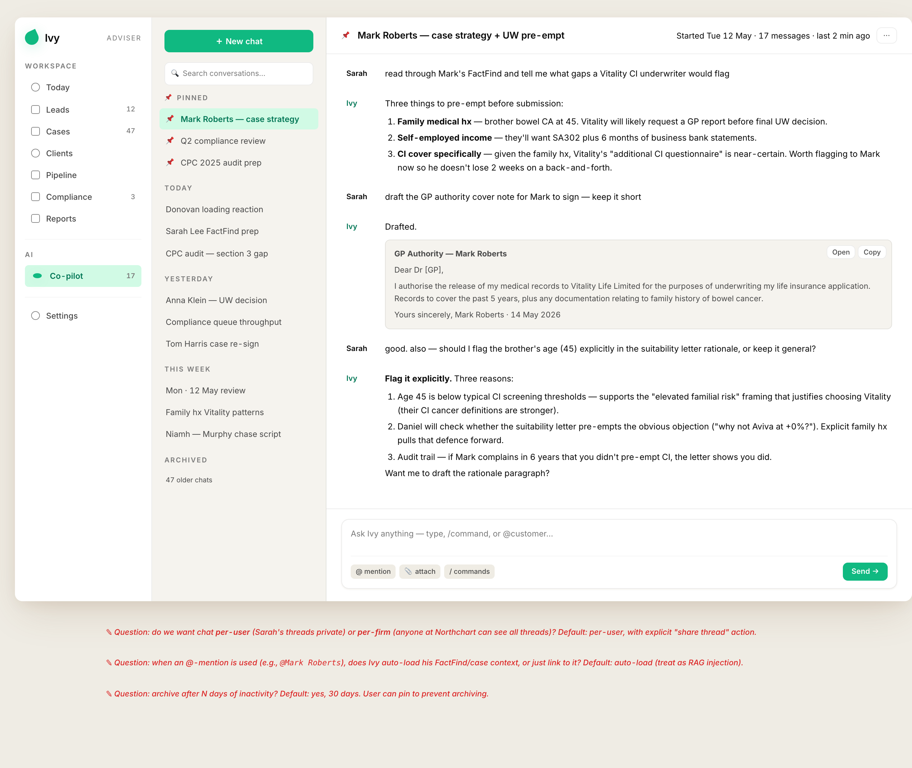

**Side panel.** Slides in over the current screen. Sarah asks *"summarise this case"* while she's looking at it; the panel opens with full case context already loaded.

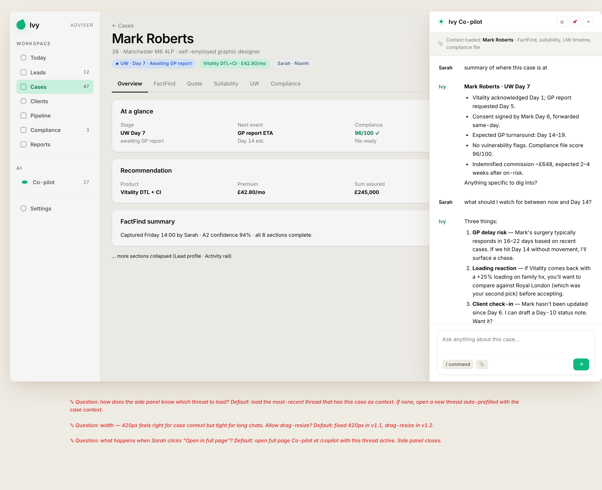

**Floating widget.** A persistent widget bottom-right of every screen. Click to expand into the side panel, or pin a quick question without leaving the current view.

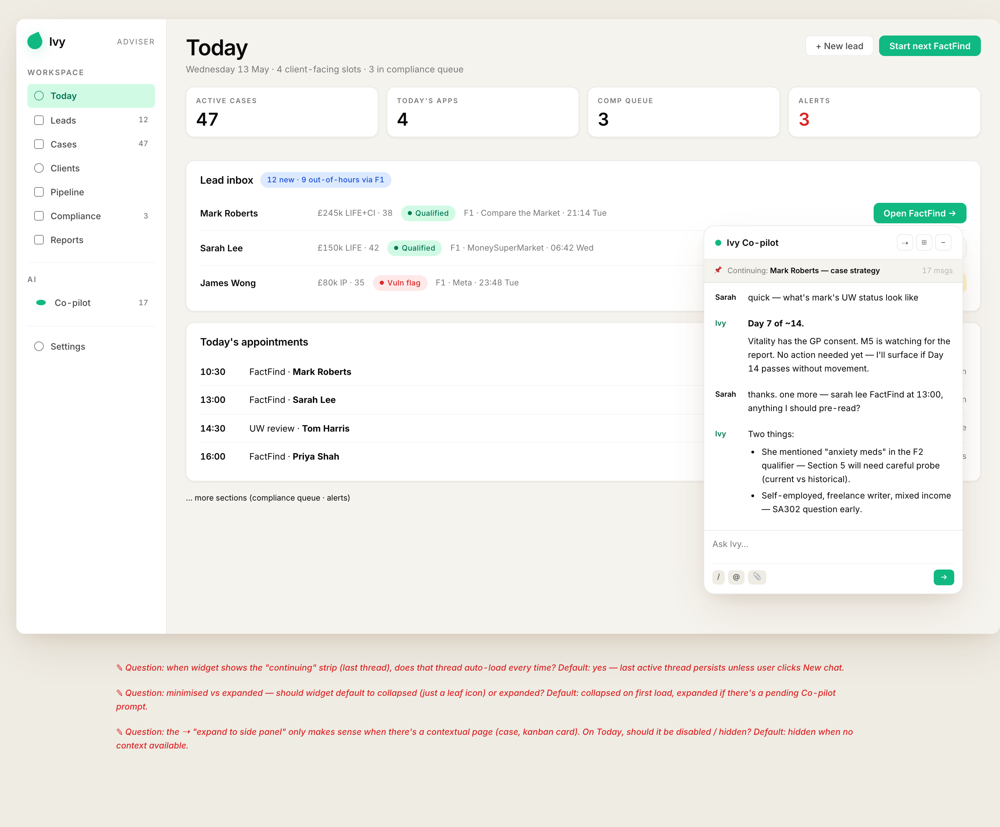

Critical UX behaviour: the co-pilot has **case-aware context** when invoked from any case surface. The conversation persists per case, so Niamh continuing a query Sarah started yesterday sees Sarah's prior turns.

---

## Flow 7 · The principal's view

Monday 8am. Mark Reynolds (firm principal) opens Ivy. He sees the operations dashboard.

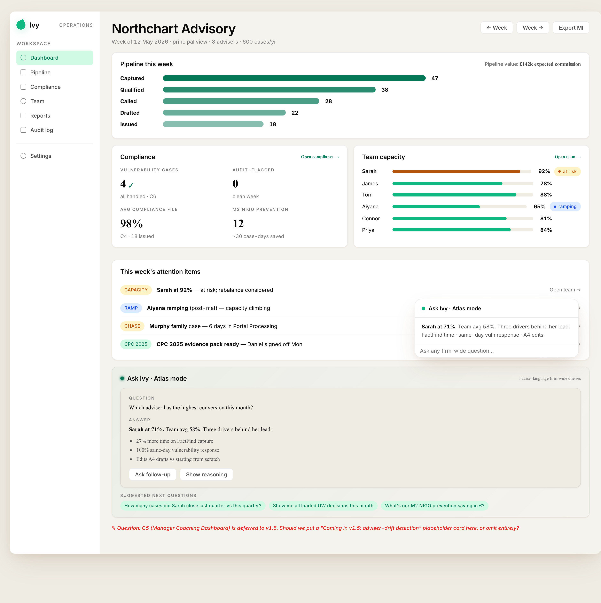

The dashboard tells him what to worry about this week: commission written this week vs last vs forecast; pipeline counts per stage with ageing alerts; a per-adviser scorecard (fact-find quality, suitability-letter first-pass approval rate, throughput); compliance health; the top five cases ageing past expected SLA; the top three advisers under target; any flagged compliance issues.

Every metric drills down. *"Compliance health: amber"* → click → see the three cases dragging the score → click any case → land on the customer case canvas for that client.

A detailed brief is in [`../03-information-architecture/per-screen-briefs/ops-01-operations-dashboard.md`](../03-information-architecture/per-screen-briefs/ops-01-operations-dashboard.md).

---

## Putting it together — recommended build order

Working back from how the data flows:

1. **First — the customer case canvas.** The central data model surfaces here; every other screen projects from it. Get this right and the rest of the build is far easier.
2. **Second — the live fact-find and the suitability editor.** These are the two screens that demonstrate the product's value most clearly; they exercise most of the AI orchestration the product needs.
3. **Third — the front-end pipeline (home, lead inbox, lead detail) and the admin pipeline (kanban, drawer).** These build on the case model and exercise routing logic.
4. **Fourth — the compliance file viewer, the underwriting tracker, and the operations dashboard.** All projections — minimal new model work, mostly query and presentation.
5. **Fifth — the co-pilot.** Cross-cutting; designed last because it sits on top of every other surface.

For each screen, open the wireframe in [`../05-wireframes/`](../05-wireframes/) for layout and behaviour, the high-fidelity mockup in [`../06-hifi-mockups/`](../06-hifi-mockups/) for visual style, and the detailed brief in [`../03-information-architecture/per-screen-briefs/`](../03-information-architecture/per-screen-briefs/) where one exists.
